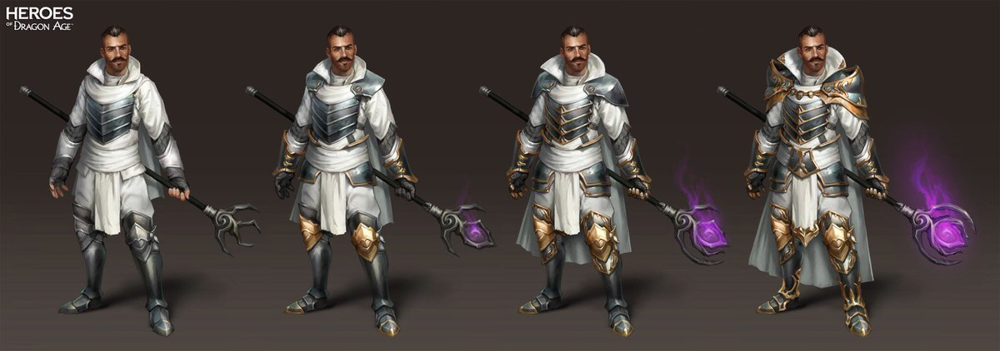

# RPG-Progression

### What do we understand by progression in RPGs?
Game progression refers to momentum earned via in game abstraction: Leveling up a character, unlocking a new skill, beating level one and going to level two and so on. What’s interesting about the two is that you can’t really track player progression on its own, but it can be measured through game progression.

Obviously someone who is really good at the game will be able to beat more levels and earn more achievements compared to someone who isn’t. Both forms of progression have the same goal: To prevent the player from feeling like their time is being wasted.

This progression can be divided into player, playable character and game:

### Progression Types
#### Player
Player progression refers to the player’s skill level improving and learning how the game works. Such as learning the right combos and special moves to use in a fighting game.
#### Character
In-game avatar becoming stronger outside of the player’s skill.
#### Game
Moving through the various levels or areas of the game until you reach the credits.
