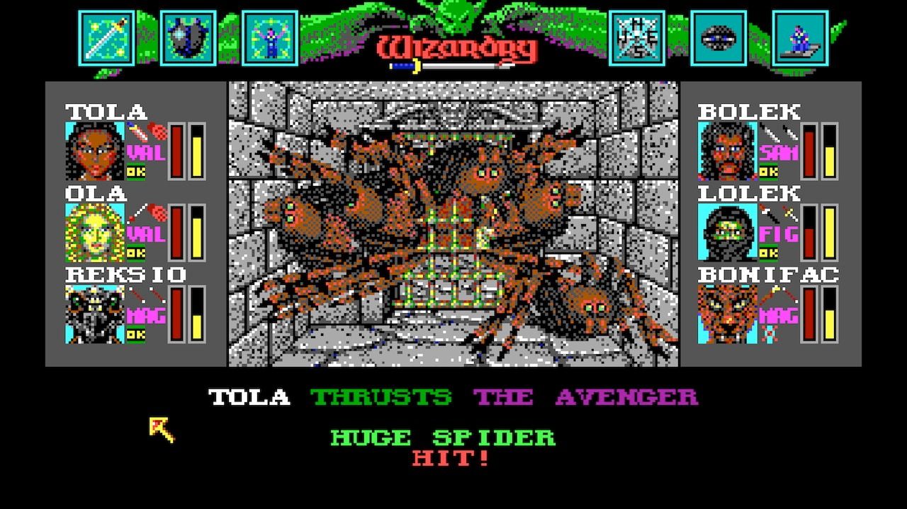

# RPG-Progression

### What do we understand by progression in RPGs?
Game progression refers to momentum earned via in game abstraction: Leveling up a character, unlocking a new skill, beating level one and going to level two and so on. What’s interesting about the two is that you can’t really track player progression on its own, but it can be measured through game progression.

Obviously someone who is really good at the game will be able to beat more levels and earn more achievements compared to someone who isn’t. Both forms of progression have the same goal: To prevent the player from feeling like their time is being wasted.

This progression can be divided into player, playable character and game:

### Progression Types
#### Player
“Player” progression refers to the person playing the game improving their skill and knowledge of the design. Many action-based titles are designed around the player getting better at the game to have any chance of winning — a big example being the Souls series.
#### Character
“Character” or “Abstracted” progression refers to the in-game avatar becoming stronger outside of the player’s skill. RPGs are the best example of this, and the whole abstract concept of leveling up.
#### Game
Moving through the various levels or areas of the game until you reach the credits.

Depending on the design of your title, you may have any combination of the three as the focal point. The important part is understanding what progression means to your title and to the people playing it.

The three types of progression that I have discussed before focus on the element that progresses, but how does this element progress?
There can be two types of progress, **positive**, the most used in digital RPGs, or **negative**, less seen in video games but quite used in tabletop role-playing games.

**Positive** progression always improves stats from low to high. Although there are attacks that can lower you some stat, if this decrease is only during combat, it is not considered negative progression.

On the other hand, **negative** progression is usually internal or external factors of the character that cause your stats to decrease. There can be many different reasons, for example, you reach a high age, you have died many times, or you have been cursed for life. Example of games with negative progression:

#### Might and Magic VIII (2000)
This game has an age penalty system. Your characters have an age variable that increases over time. When you reach a certain age, the stats are reduced and even, after 80 years of age, in the middle of a fight, you can die.

#### Wizardry VI (1990)
In this game when a character in your group dies, you can revive him, but with less and less life. When it reaches 0 health after being revived several times, it can no longer be used.

But, let's go further, before digital RPG games were created. Let's talk about the first official character progression system.

### Basic Role-Playing

**Basic Role-Playing** it's a rule book of a tabletop role-playing game which originated in the RuneQuest fantasy role-playing game, in 1980. BRP is similar to other generic systems such as GURPS, Hero System or Savage Worlds in that it uses a simple resolution method which can be broadly applied. BRP uses a core set of seven characteristics: Size, Strength, Dexterity, Constitution, Intelligence, Power, and Appearance or Charisma. From those, a character derives scores in various skills, expressed as percentages. These skill scores are the basis of play. When attempting an action, the player rolls percentile dice trying to get a result equal to or lower than the character's current skill score.

The last major element of many BRP games is that there is no difference between the player character race systems and that of the monster or opponents. By varying ability scores, the same system is used for a human hero as a troll villain. This approach allows for players to play a wide variety of non-human species.

### Grind
#### What is this?
“Grinding” or “Grind” can mean different elements depending on the genre and player, we’re going to define it as this:

Grind: The period of time in a game when the player’s ability to progress is reduced to a few set options, and everything else will not move them forward.

One of the key signs that your game becomes a grind is when there are things the player could be doing, but doing them would be a waste of time at this point. A famous example is from the MMO genre, and if the player runs out of quests at their level range to do, doing lower level quests will not earn them anywhere near the experience needed to keep going.

#### How to eliminate grind?

To eliminate or mitigate grind, the first step for any game regardless of design is to look at the trouble areas of your game. At what point do you see people quitting, and is there a period in your game that is taking the longest to get through?

From there, it comes down to adding in more viable options for progressing. One of the simplest, yet effective systems is the concept of “milling.” Milling is a term used in CCG and F2P-styled games, and is the act of taking a resource or item you don’t want, and converting it to something you do.

Knowing how to win, but not being able to do it yet, is one of the worst aspects of padding out a game

Fairy dust in Hearthstone is an example of this practice. We can also see this in Darkest Dungeon with the ability to trade heirlooms.

The more ways for a player to make progress will decrease the chance of the game becoming a grind. Some titles will let any action the player does contribute towards experience or leveling up.

#### Bad example of grinding

The Inazuma Eleven saga has a mechanic of random matches or friendly matches throughout the game. As you go down the street, from time to time, a team appears that challenges you to a match. These matches are the equivalent in a classic RPG to a combat.
These fights cannot be avoided in any way, unless you have a special item, difficult to obtain. At first it´s fun, but over time you get tired of repeating the same thing all the time without receiving anything positive in return. This is a form of grinding, in Inazuma Eleven Go it is fixed:

#### Good example of grinding

In Inazuma Eleven Go they have some random encounters, but only once per NPC. Then you will find the NPCs in the same place to be able to challenge them if you want. You don't force the player to have to face each other all the time, you let him decide whether to grind or not.
